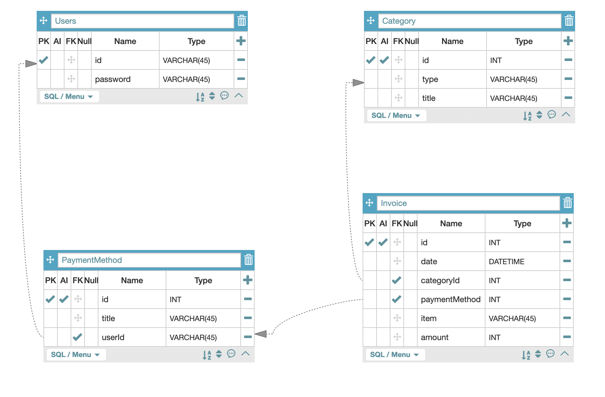
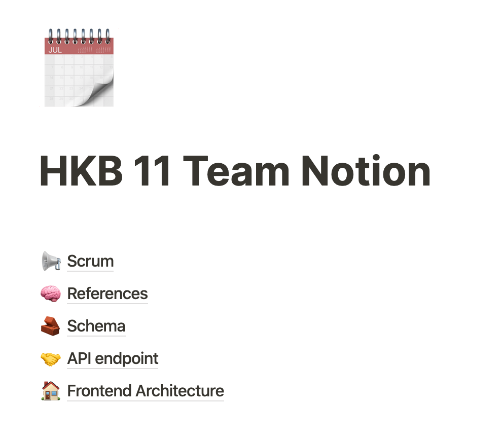
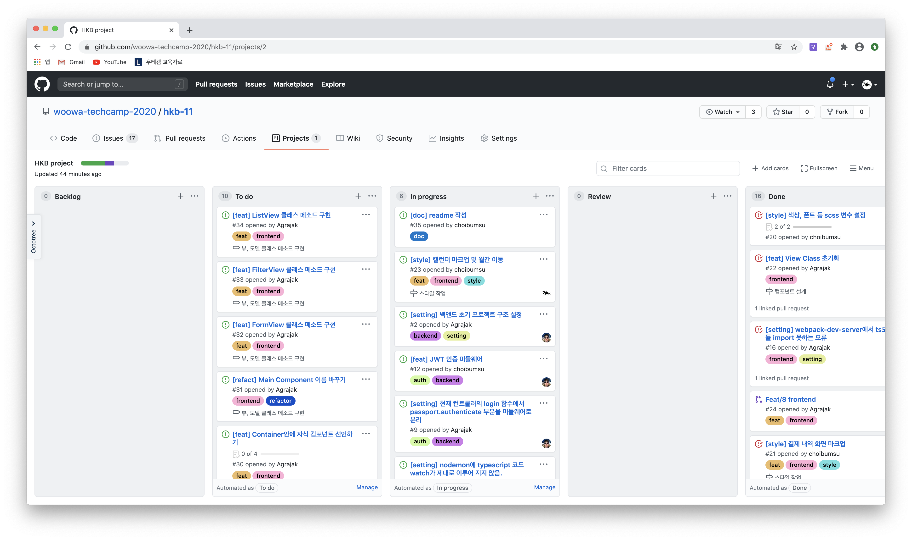
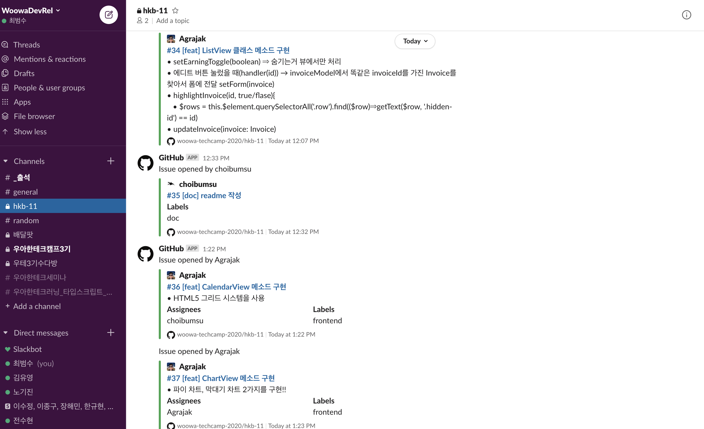

# HKB 11 Team

결제내역 관리 프로젝트  
**[팀 협업 노션](https://www.notion.so/bumsu/HKB-11-Team-Notion-a979dd1fb6e14cd5a30382c58403de47)**

## ✋Team Members
- [](https://github.com/agrajak)
- [](https://github.com/choibumsu)

------

## Team Rules

👉🏻 [In here](https://github.com/woowa-techcamp-2020/hkb-11/wiki/Ground-Rule)

------
## 🧞Quick Start

### 1. Clone & Install Packages
```bash
git clone https://github.com/woowa-techcamp-2020/hkb-11.git

cd hkb-11

npm install
```

### 2. Add .env
Add `.env` to root folder

```
DB_HOST= *.*.*.*
DB_USER= agrajak
DB_PASSWORD= ********
DB_DATABASE= hkb 
```

### 3. Run server
**Develop mode**
```bash
npm run dev
```

automatically open http://localhost:9000

**Production mode**
```bash
npm start
```

Then, you can access to your server http://localhost:3000

------

## 👨🏻‍💻 기술 스택
**Common**
- 
- 
- 
- 


**Frontend**
- 
- 
- 
- 

**Backend**
- 
- 
- 
- 

**ETC**
- 
- 
- 
- 


------

## Frontend Architecture

### MVC 패턴
- Model
- View
- Component (=Controller)

### Observer 패턴
- Model : Observable Class
- Component : Model 구독
- Model의 변화가 생기면 구독한 Component에 연락
- Component는 자신이 가지고 있는 View의 핸들러를 호출
- View의 핸들러는 자신의 화면을 조작하는 역할을 담당

**Model과 View의 연결을 느슨하게 함**

------

## Database

### ERD


------
## 협업 방식

### 1. Notion


[HKB Team 11 Notion Check It Out!](https://www.notion.so/bumsu/HKB-11-Team-Notion-a979dd1fb6e14cd5a30382c58403de47)


------

### 2. Github Project Board


- Github Board를 통해 이슈를 생성
- 이슈에 라벨과 마일스톤 등록 후 업무 분할
- 컴포넌트별로 이슈를 만들고, 해당 컴포넌트에서 수행해야 하는 모든 동작을 이슈에 작성
- 이슈 내용에 체크박스를 통해 팀원이 세부적인 진행사항을 파악할 수 있도록 함

------

### 3. Slack



- Github에서 이슈 생성 및 종료, 풀리퀘스트 등록 및 머지 등의 작업마다 슬랙 메세지 전송

------

### 4.Pair Programming


- 폴더 구조 설계, DB Table 설계, HTML 마크업 등의 작업을 페어 프로그래밍으로 진행
- Thanks to Lenovo Monitor

------

### 5. Code Convention

아래 모든 것들의 컨벤션을 정의하고 작업
- branch, issue, commit message
- file name, class name, variable name
- function name
  - HTMLElement 변수는 `$`로 시작한다.
  - 버튼에 할당된 이벤트핸들러는 행위를 기준으로 `bind+명사+동사+handler` 라고 정한다.  (ex. `.button-add-invoice` -> `bindAddInvoiceHandler` )


